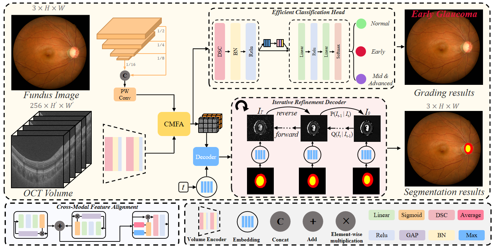
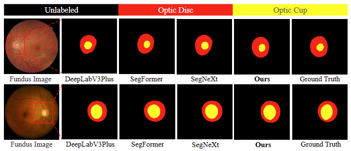
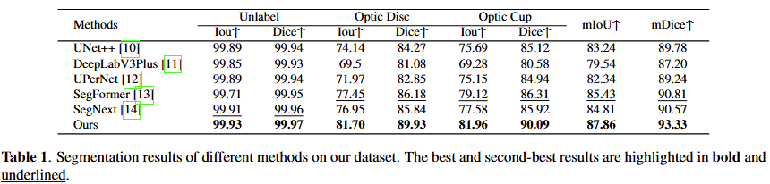
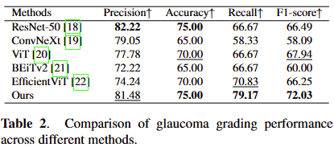

# IMO
This is official Pytorch implementation of "[Joint Segmentation and Grading with Iterative Optimization for Multimodal Glaucoma Diagnosis]()"
 - 
```
@article{
}
```
## Framework


## Recommended Environment
 - [ ] torch  1.13.1
 - [ ] cudatoolkit 11.8
 - [ ] torchvision 0.14.0
 - [ ] mmcv  2.2.1
 - [ ] mmcv-full 1.7.2
 - [ ] mmsegmentation 0.30.0
 - [ ] numpy  1.26.4
 - [ ] opencv-python 4.10.0.84

## Experiments 
### Dataset & Checkpoints & Results
The checkpoints and results can be in [IMO](). Download MSRS dataset from [GAMMA]().
If you need to evaluate other datasets, please organize them as follows:
```
├── /dataset
    GAMMA/
    ├── Cls
    │   ├── train
    │   │   ├── class1
    │   │   ├── class2
    │   │   └── class3
    │   └── val
    │       ├── class1
    │       ├── class2
    │       └── class3
    └── Seg
        ├── class_label.txt
        |
        ├── test
        │   ├── label
        │   ├── oct
        │   └── vi
        │   
        └── train
            ├── label
            ├── oct
            └── vi
        ......
```
### Evaluate model
python
```
python test_model.py
```
### run sample
python
```
python test_demo.py --img="./images/00131D_vi.png" --ir="./images/00131D_ir.png" --checkpoint="./exps/Done/msrs_vi_ir_meanstd_ConvNext_fusioncomplex_8083/best.pth" --segout="./seg.png"
```
### To Train
Before training IMO, you need to download the GAMMA dataset and putting it in ./datasets.

Then running 
python
```
python train_model.py
```
### Segmentation comparison


### Grading comparison


## If this work is helpful to you, please cite it as：
```
@article{
}
```
## Acknowledgements
